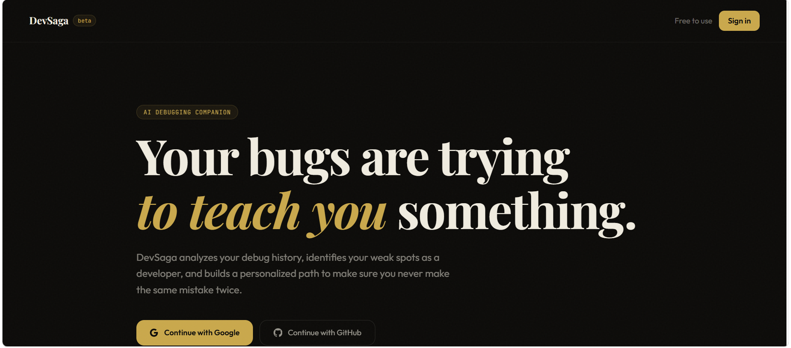
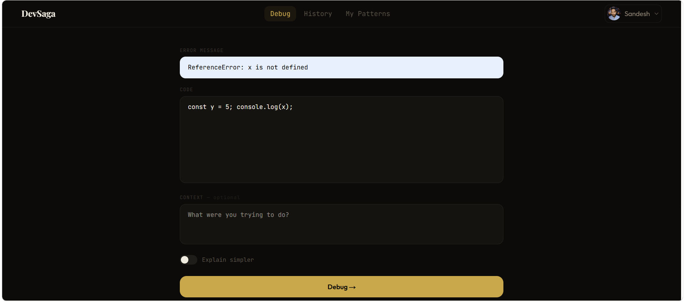
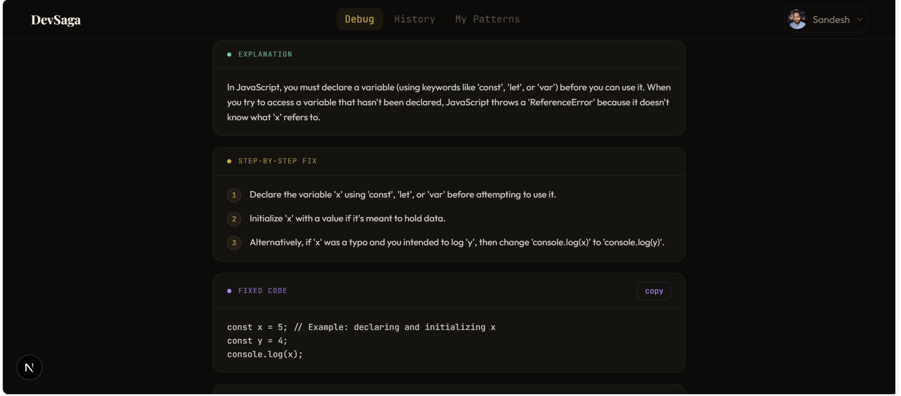
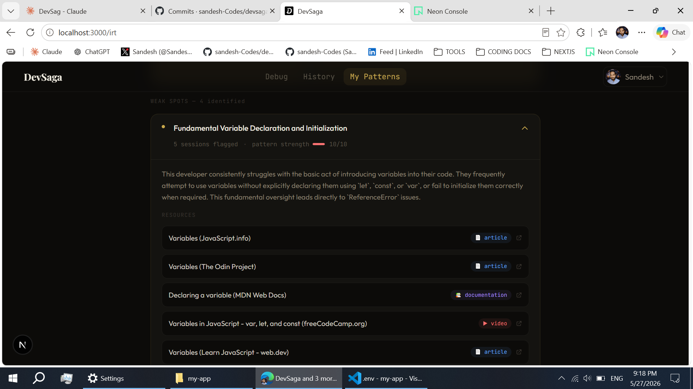

# DevSaga
### *"Learning from mistakes never been so easy."*

DevSaga is an AI-powered debugging companion that doesn't just fix your errors — it tracks your patterns, identifies your weak spots, and runs you through a personalised test to make sure you actually improve over time.

**→ [Live Demo](https://devsaga-app.vercel.app)** · [GitHub](https://github.com/sandesh-Codes/devsaga)

---

## ✨ Features

### AI Debugging
Paste your error, code, and context. Get a structured response with a plain-English explanation, root cause analysis, step-by-step fix, corrected code, and a list of common related mistakes — no walls of text.

### Debug History
Every session is saved to your account. Browse and expand past errors anytime to revisit what went wrong and how it was fixed.

### Insights Resources & Tests (IRT)
After enough sessions, DevSaga analyses your history and surfaces your recurring weak spots — the patterns you keep hitting. For each weak spot it:

- **Identifies the gap** — a clear summary of what you're struggling with and why
- **Curates free resources** — hand-picked articles, videos, and documentation targeted at your specific issue
- **Generates a personalised test** — a real-world broken code problem and scenario-based MCQs built around your weak area
- **Reviews your attempt** — honest AI mentor feedback with a score, MCQ breakdown, code review, and a concrete next step

---

## Tech Stack

| Layer | Technology |
|---|---|
| Framework | Next.js (App Router) |
| Database | Neon Postgres |
| ORM | Prisma |
| AI | Gemini 2.5 Flash (`@google/genai`) |
| Auth | NextAuth.js — Google & GitHub OAuth |
| Styling | Tailwind CSS + shadcn/ui |
| Deployment | Vercel |

---

## Screenshots

### Home Page


### Paste error & code


### Get fixed code & error explanation


### AI determines your weak concepts from your debugging, gives you best free resources to master that weak concept & then AI generates a test personalized to your weak concept, A test based on real world scenarios & broken code


---

Try the [live demo](https://devsaga-app.vercel.app)

---

## 🚀 Getting Started

### Prerequisites
- Node.js 18+
- A [Neon](https://neon.tech) database (free tier works)
- A [Google AI Studio](https://aistudio.google.com) API key (free tier works)
- Google and/or GitHub OAuth app credentials (for auth)

### Installation

**1. Clone the repository**
```bash
git clone https://github.com/sandesh-Codes/devsaga.git
cd devsaga
```

**2. Install dependencies**
```bash
npm install
```

**3. Set up environment variables**

Create a `.env` file in the root. You'll need:

```env
# Database (Neon)
DATABASE_URL=your_pooled_connection_string
DATABASE_URL_UNPOOLED=your_unpooled_connection_string
SHADOW_DATABASE_URL=the_second_unpooled_branch_of_db_for_dev_migrations

# AI
GEMINI_API_KEY=your_gemini_api_key
GEMINI_MODEL=any_gemini_model

# Auth (NextAuth)
NEXTAUTH_URL=http://localhost:3000
NEXTAUTH_SECRET=your_nextauth_secret

# OAuth
GOOGLE_CLIENT_ID=your_google_client_id
GOOGLE_CLIENT_SECRET=your_google_client_secret
GITHUB_ID=your_github_id
GITHUB_SECRET=your_github_secret
```

**4. Set up the database**
```bash
npx prisma migrate dev
```

**5. Run the development server**
```bash
npm run dev
```

Open [http://localhost:3000](http://localhost:3000) in your browser.

---

## 📁 Project Structure

```
src/
├── app/
│   ├── page.js              ← debug page
│   ├── login/page.js        ← auth page
│   ├── history/page.js      ← debug history
│   ├── irt/page.js          ← IRT dashboard
│   └── api/
│       ├── debug/           ← open, saves if signed in
│       ├── history/         ← auth gated
│       └── irt/             ← analyze, resources, weakspots, test
├── components/
│   ├── LandingPage.jsx
│   ├── layout/              ← Topbar, MobileMenu
│   ├── debug/               ← DebugInput, DebugOutput, etc.
│   └── irt/                 ← WeakSpotCard, TestSection, ReviewStep, etc.
├── config/                  ← debugConstants, irtConstants
├── lib/                     ← db, ai, prompts
└── utils/                   ← parser
```

---

## 👨‍💻 Author

**sandesh-Codes**

- GitHub: [@sandesh-Codes](https://github.com/sandesh-Codes)
- Live: [devsaga-app.vercel.app](https://devsaga-app.vercel.app)

---

*Built to make debugging less painful and learning more personal.*
